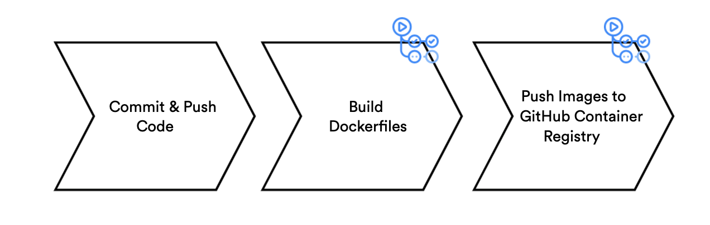

# ToDo-App

This project shows how to run a todo application on Docker and on Kubernetes, using a Spring boot backend and a Rect.js frontend.


## Features 

* Retrieving the current list of todo tasks
* Adding a new todo task
* Finding a todo task by its ID
* Updating an existing todo task
* Deleting a todo task

### Objectives 

* Build and deploy the Docker image of the application 
* Run the containerized application on Kubernetes  


## Installed technologies 

- Java 11
- React 18 
- Docker - https://docs.docker.com/install/
- Docker compose - https://docs.docker.com/compose/install/
- PostgresSQL 14.3


## **Project Setup**
A ShellScript has been created to ease the configuration process. Giv permission to the file with the following command `sh ./init.sh` in the project root to run it.

This script does the following:

1. Run Gradle _**clean**_ and _**build**_ inside the **backend** project folder.
2. Run the _**yarn install**_ in the **frontend** project.
3. Run _**docker-compose up --build**_ at the root to create and run the projects inside the Docker containers.


## Spring Boot Manual Setup

Before starting project containers using **Docker Compose** 
Build the API project using **Gradle** with the following command:

```
 gradle clean build 
```

This command will generate the .jar file that will be executed in the backend container.

This command should be run in the terminal of the **backend** project root.


## ReactJS manual configuration


## Scripts

After cloning the project, run the following command:

```
 yarn install
```

This command is responsible for installing the dependencies needed to run the project.

Both commands must be run in the project's root terminal **frontend**.


## Starting the containers and running the project

Three containers were set up to create the application:

- Postgresql database running on port 5432.
- Spring Boot running on port 8080 using Java 17.
- ReactJS running on port 3000.

To start the containers and run the applications just run the following command in the project root where the _**docker-compose.yml**_ file is located:

```
  docker-compose up --build
```

This command will download the images, create the containers and run them.


## Accessing the application

### Frontend

After the containers are started you should be able to access the applications. Open in your browser the link http://localhost:3000 to access the frontend project. 

### Backend

Just like the frontend project, the backend will be running and can be accessed through the link http://localhost:8080/api/task.


### Database

The credentials to access the database for this application are as follows:

- HOST: **localhost**
- PORT: **5432**
- USERNAME: **taskuser**
- PASSWORD: **123456**
- DATABASE NAME: **task**


## CI/CD (Delivery) Pipelinne





