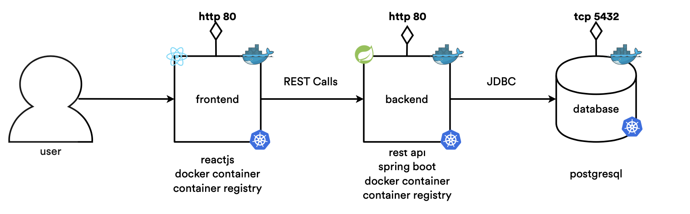

# ToDo-App version 1.0.

This project shows how to run a todo application on Docker and on Kubernetes, using a Spring boot backend and a Rect.js frontend.

Here is an architecture of this todo application 

