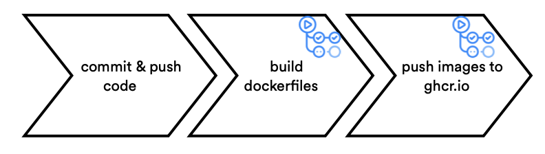
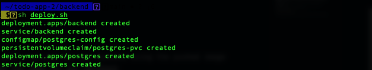

# deploy the backend docker image to kubernetes

## understand the backend java application

this app uses remote api to handle data persistence. the backend implements five rest api including: 
* retrieving the current list of todo tasks
* adding a new todo task
* finding a todo task by its id 
* updating an existing todo task
* deleting a todo task

the backend will be running and can be accessed through the link http://localhost:8080/api/task

the backend is implemented using the following java classes (under ./backend/src/...):
* main.java: starts and configure the main entry points 
* taskdto.java: maps a todo task instance to and from the json document 
* taskrepository.java: stores the todo item in a database 
* taskservice.java: implements the service and exposes the rest api

### database

the credentials to access the database for this application are as follows:

- port: **5432**
- username: **taskuser**
- password: **123456**
- database name: **task**

### objectives

* build and depoly the docker image of the application
* deploy the image on the tanzu community edition cluster on azure
* test the backend application

## build and push the docker images to the github container registry 

the container registry is where your docker images are managed

the main.yml file (./.github/workflows/...) allows to build the backend image from the dockerfile (./backend/...) and to push it directly in the github registry
a new image is pushed at each push in the repository thanks to github actions (https://github.com/features/actions)



in a couple of minutes, you should have successfully built an pushed the images into the ghc repository 


## deploy on kubernetes and check the status 

we can now write a deployment and a service for our backend using the pushed image 
it will also be necessary to do the same for our database
the template of our yaml resources for kubernetes deployment is in ./kubernetes/...

run rhe `deploy.sh` script 
```
./ deploy.sh
```

if everything runs correctly the script will output something like this 


the following command returns the kubernetes services of the todo application and the database: 
`kubectl get services`

the following command returns all the pods running in your kubernetes cluster: 
`kubectl get pods`

you can tail the log of one of the pods by running: 
`kubectl logs -f <pod name>`

## testing the backend application

it should display the todo tasks in the todotask table that was create in the database 


